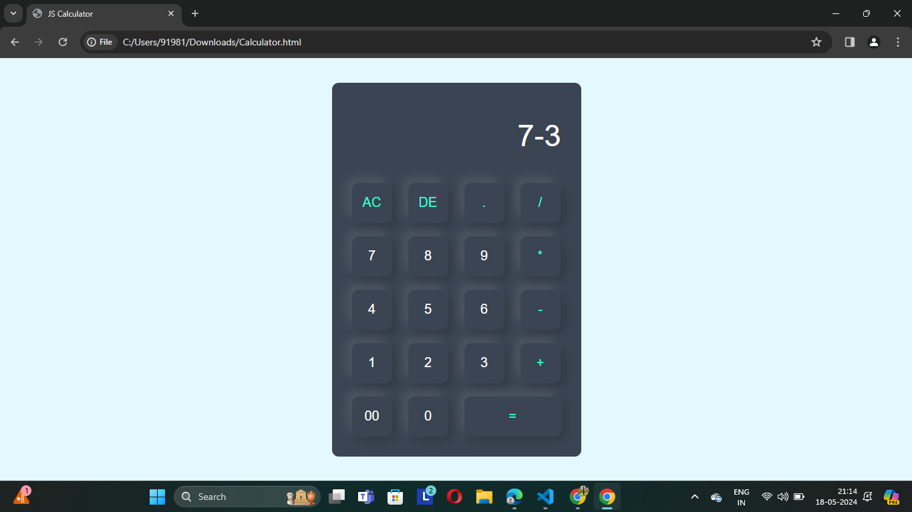

# Calculator 
This is a simple calculator web application built using HTML, CSS, and JavaScript. It allows users to perform basic arithmetic operations such as addition, subtraction, multiplication, and division.

## Features :
- Basic arithmetic operations: Addition, Subtraction, Multiplication, Division
- Decimal point support
- Clear display (AC - All Clear, DE - Delete Entry)
- Evaluates mathematical expressions using JavaScript's eval() function
  
## Output
 
